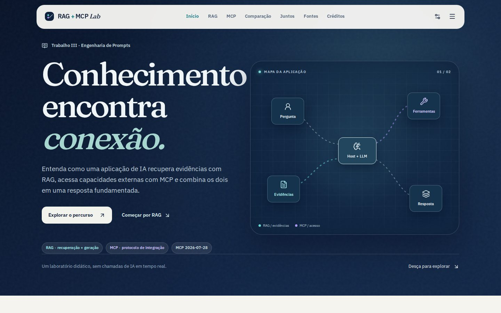

# RAG + MCP Lab

**Trabalho III — Engenharia de Prompts Aplicada à Inteligência Artificial**

Microsite educacional em português sobre Retrieval-Augmented Generation (RAG), Model Context Protocol (MCP) e o uso complementar das duas abordagens em um assistente universitário fictício.



[Prévia mobile](docs/preview-mobile.jpg) · [Interação desktop](docs/preview-interaction-desktop.jpg) · [Interação mobile](docs/preview-interaction-mobile.jpg) · [Tema escuro](docs/preview-dark.jpg) · [Créditos](docs/preview-credits.jpg)

## O percurso

- O problema de um LLM isolado: dados privados, informações atuais e ferramentas.
- RAG: preparação do índice, recuperação, construção do contexto e resposta com fontes.
- Simulação RAG local sobre uma biblioteca fictícia, com documentos inspecionáveis.
- Seletor de perguntas acessível, cabeçalho que indica a seção em leitura e entradas suaves dos blocos durante o scroll.
- MCP 2026-07-28: host, cliente, servidor, tools, resources, prompts e chamadas stateless.
- Exemplo MCP isolado numa IDE fictícia e um caso integrado em nove passos.
- Comparação, mapa de componentes, segurança, fontes e transparência de produção.
- Página `/creditos` com os integrantes e avatares ilustrativos.

As demonstrações são determinísticas e executadas no navegador. O projeto não solicita credenciais, não invoca um LLM ou servidor MCP real e não envia perguntas a uma API. `XXX horas` e `[Documento X]` são marcadores didáticos; não há regras institucionais reais nos exemplos.

## Executar

Requer Node.js 20.9+ e npm.

```bash
npm ci
npm run dev
```

Abra `http://localhost:3000`.

| Script              | Uso                   |
| ------------------- | --------------------- |
| `npm run dev`       | Desenvolvimento local |
| `npm run lint`      | ESLint                |
| `npm run typecheck` | TypeScript strict     |
| `npm run build`     | Build de produção     |
| `npm run start`     | Servir o build        |

Stack: Next.js App Router, React, TypeScript strict, Tailwind CSS 4, Framer Motion e Lucide. Os componentes interativos são Client Components; conteúdo estático é renderizado no servidor. As fontes locais são carregadas com `next/font/local`, com licenças em `docs/`.

## Organização

- `app/`: rotas, metadata, fontes e estilos;
- `components/`: seções didáticas, componentes interativos e interface compartilhada;
- `data/`: textos, referências, contratos e exemplos determinísticos;
- `docs/SKILL.md`: instrução principal fornecida ao projeto;
- `TRABALHO_III_SITE_WORK_SPEC.md`: especificação acadêmica complementar.

## Vercel

Importe este repositório como projeto Next.js com a raiz na raiz do repositório. O build padrão é `npm run build`. Não há variáveis de ambiente. **URL pública:** a definir após o deploy e a liberação de acesso público; nenhuma URL de preview anterior foi reaproveitada.

## Fontes principais

- [Lewis et al. (2020), artigo de RAG](https://arxiv.org/abs/2005.11401)
- [Especificação MCP 2026-07-28](https://modelcontextprotocol.io/specification/2026-07-28)
- [MCP TypeScript SDK v2](https://ts.sdk.modelcontextprotocol.io/v2/protocol-versions)
- [Microsoft Learn — RAG](https://learn.microsoft.com/en-us/azure/search/retrieval-augmented-generation-overview)
- [OWASP — Prompt Injection](https://genai.owasp.org/llmrisk/llm01-prompt-injection/)
- [NIST IR 8579](https://csrc.nist.gov/pubs/ir/8579/ipd)

O site apresenta as referências completas e distingue a revisão atual do protocolo do fluxo histórico de 2025.

## Transparência

ChatGPT — GPT-5.6 Sol apoiou análise, síntese e especificação; Deep Research apoiou o levantamento técnico; ChatGPT Work foi usado para implementar o microsite. A seção “Como este trabalho foi preparado” reserva campos para o grupo registrar as decisões e revisões humanas efetivamente realizadas, sem inventá-las. GitHub registra versões; Vercel é o destino de hospedagem planejado.

## Integrantes

| Nome                  | RA        | Contato                                             |
| --------------------- | --------- | --------------------------------------------------- |
| Júlia B. Souza        | 5179343-1 | —                                                   |
| Antônio J. T. Neto    | 5178724-1 | [GitHub: ZpkDxGames](https://github.com/ZpkDxGames) |
| Matheus A. D. Barbara | 5174907-1 | —                                                   |

Os avatares em pixel art são ilustrativos. A página de créditos coloca Antônio no centro em telas largas.

Os resultados de verificação desta reconstrução estão em [`docs/QA.md`](docs/QA.md).
